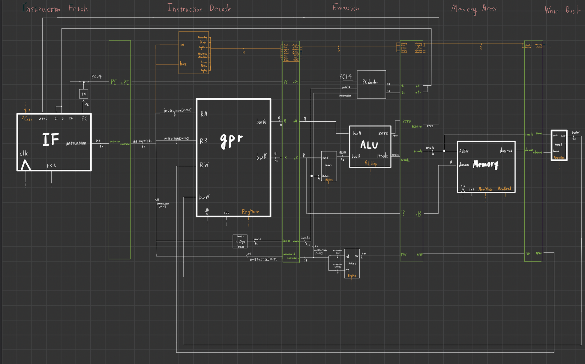

# MIPS Instruction Set Architecture Processer

# Entity: core 
- **File**: core.v

## Diagram

## 簡介
設計MIPS指令集構的處理器,並且優化它。
從最基本的Single Cycle Processer到加入了Pipeline的Multi Cycle Processer,再到排除Hazards後,形成功能正常與速度更快的一顆的Multi Cycle Processer。

## 基本單元
1. Instruction Fetech ( IF )  : 它的核心為Instructions Memory,這個單元主要的工作是透過其單元的回傳訊號負責決定下一個PC(Program Counter),並且輸出當前PC所指定到的Instructions給下一個單元使用。
2. General Purpose Register ( gpr ) : 暫存器,32個 4 Byte 組成的儲存單元,是該電腦最靠近運算單元的儲存單元,存取速度遠高於其他儲存單元。(特點:速度快、容量小)
3. Arithmetic Logic Unit ( ALU ) : 算術與邏輯運算單元,透過Operation code (op-code)與兩個輸入決定怎麼運算,最終輸出運算後的結果 ! 
4. Memory : 這個單元負責存取比較大量的資料,通常使用造價較便宜容量大但速度慢的方式。(特點:速度慢、容量大)
5. Control Unit : 這個負責照造出對應的Control Wire,讓處理器可以透過這些Wire選擇出正確的道路,控制各個單元的運作。

## Instruction Set
可執行指令:
R-Type:or、and、add、sub
I-Type:ori、andi、addi、lw、sw、beq
J-Type:j

## Multi Cycle Processer 

### Pipeline
介紹 : Multi Cycle與Single Cycle主要的差距在於Pipeline,Pipeline的功用在於可以把工作切成很多段完成,這個的好處就是一個可以把時脈提升加快執行速度,加入Pipeline後只要分割後的單元最久Delay時間就可以了,而非原本要等到全部執行的Delay時間。
Issue : 當Pipeline切的太細,效能又需要維持時,時脈就必須拉高,*時脈高*會導致處理器的*功耗上升*,會有嚴重的*發熱*問題,所以不得過於追求更多層的Pipeline,除了這個問題之外,對於Pipeline最棘手的就是Hazards了！
### Hazards
Hazard是我們加入Pipeline後最大的困擾,Hazard主要分為三種。

- Structure Hazard : 多個指令用相同的硬體資源(把四階可Write Back的指令,拉成五階)
- Data Hazard :
    Forwarding : 在MIPS指令集裡會發生 Read After Write ,解決方法就是當要使用資料的時候檢查後面時否有指令剛好要存取在我們要讀出來的值,如果是的話我們可以直接取用(取用順序EXE/MEM > MEM/WB > GPR) 
    Stall : Forward不能完全解決Read After Write這件事,因為當LW後要直接取用Load進來的值時會產生錯誤,因為Forward在尋找那個值的時候load word指令還尚未把值從Memory讀取出來,解決辦法就是在LW指令後插入一個Nop(instruction=0**、**PC不變)(此部分code直接寫在IF單元裡面)。
    
- Control Hazard :beq、jump指令判斷到是否branch時,已經讀取了許多指令,而我們並沒有要執行那些指令,那些指令會造成最後結果錯誤,所以要把它清除掉。

## Simulator
我們以最終的成果Multi Cycle Processer作為模擬,來觀察各個指令所造成的結果與是否成功解決Hazard。
Simulation Method:將1~4組的Task執行,並檢查最後暫存器與記憶體值是否正確。
Simulation Tool : ModelSim ALTERA STARTER EDITION 10.1d
### 測試指令介紹:

#### Task 1
Simulation Target:這些指令接不會使用到Forwards,主要是測試基本功能(無forwarding)的正確性

or $t0 $a0 $a1
and $t1 $a1 $a3
add $t2 $a2 $a0
sub $t3 $a2 $a0
ori $t4 $a2 0x1adc
andi $t5 $a1 0x4faf
addi $t6 $a2 0x5dff

#### Task 2
Simulation Target:在這項測試中你會發現有許多資料是還沒被WB就被使用,在這項測試中可以測試我們的Forwards unit 是否正常的工作幫我們把正確的資料送進去運算。

addi $a1 $a0 0x09f
addi $a2 $a0 0x09e
sub $a3 $a1 $a2
addi $t0 $a3 0x0002;
addi $t1 $t0 0x0003;
#### Task 3
Simulation Target:這項測試是在測試我們的LW與SW是否正常的運作,並且觀察是否有成功的Stall,並且讀取到LW後的值。
lw $a1 0x003($v0)
sw $a0 0x008($zero)
lw $a2 0x003($v0)
add $a3 $a2 $v0
#### Task 4
Simulation Target:這項指令我們可以觀察到如果發生Control Hazard時,是否有成功清除不該執行的指令。
beq $v1 $a1 0x001
addi $a3 $a3 0x001
beq $v0 $a0 0x001
addi $t0 $t0 0x001
addi $t0 $t0 0x001
nop
j 0x009
addi $t1 $t1 0x001
addi $t1 $t1 0x001
